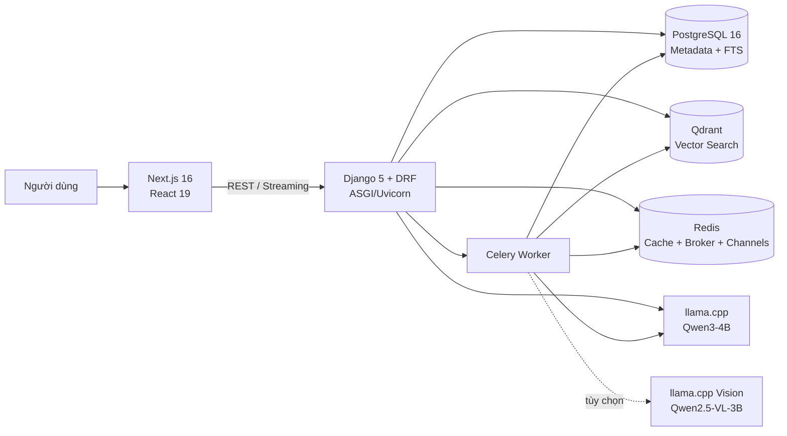
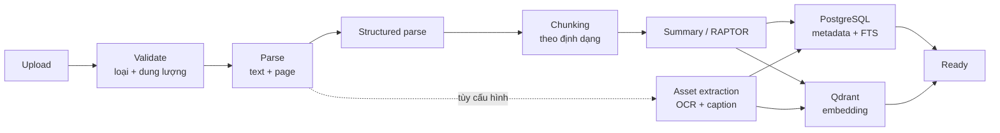
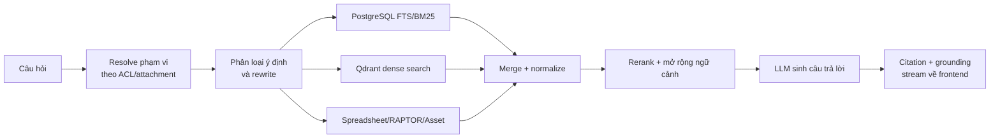

# Enterprise RAG Knowledge Management System

Hệ thống quản trị tri thức doanh nghiệp kết hợp **Retrieval-Augmented Generation (RAG)**, cho phép tổ chức tài liệu theo phòng ban/thư mục, phân quyền đến từng tài nguyên, xử lý nhiều định dạng tài liệu và trò chuyện với AI dựa trên nguồn dữ liệu mà người dùng được phép truy cập.

> README này mô tả trạng thái hiện tại của mã nguồn. Kiến trúc đang sử dụng **Django + PostgreSQL + Qdrant + Redis/Celery + Next.js + llama.cpp**, không còn sử dụng MongoDB/ChromaDB như các tài liệu cũ.

## Trạng thái và phạm vi dự án

Đây là hệ thống đang trong giai đoạn phát triển và hoàn thiện cho môi trường local/on-premise có GPU. Các chức năng cốt lõi đã có trong mã nguồn gồm IAM/RBAC, quản lý phòng ban, ACL tài liệu/thư mục, ingestion bất đồng bộ, hybrid retrieval, chat có citation, audit log, soft delete/restore và quản lý phiên bản tài liệu.

Trước khi dùng cho production cần lưu ý:

- Compose hiện ưu tiên môi trường phát triển, sử dụng CUDA và chưa đóng gói frontend.
- Backend Compose đang đặt `DEBUG=true` và `ALLOWED_HOSTS=*`.
- PostgreSQL, Redis, Qdrant và llama.cpp đang publish cổng ra máy host.
- Endpoint `/health/` chỉ xác nhận process Django phản hồi; không kiểm tra sâu PostgreSQL, Redis, Qdrant, Celery hoặc model.
- Repository chưa có file license, release versioning hoặc tài liệu SLA.
- Secret từng xuất hiện trong lịch sử Git phải được thu hồi và xóa khỏi lịch sử trước khi public repository.

Vì các lý do trên, nhãn “production-ready” chỉ nên được sử dụng sau khi hoàn thành checklist tại phần [Triển khai production](#triển-khai-production).

## Mục lục

- [Trạng thái và phạm vi dự án](#trạng-thái-và-phạm-vi-dự-án)
- [Tính năng chính](#tính-năng-chính)
- [Kiến trúc hệ thống](#kiến-trúc-hệ-thống)
- [Công nghệ sử dụng](#công-nghệ-sử-dụng)
- [Luồng xử lý tài liệu và truy vấn RAG](#luồng-xử-lý-tài-liệu-và-truy-vấn-rag)
- [Cấu trúc mã nguồn](#cấu-trúc-mã-nguồn)
- [Yêu cầu hệ thống](#yêu-cầu-hệ-thống)
- [Khởi chạy nhanh](#khởi-chạy-nhanh)
- [Cài đặt chi tiết](#cài-đặt-chi-tiết)
- [Sử dụng hệ thống](#sử-dụng-hệ-thống)
- [API chính](#api-chính)
- [Mô hình dữ liệu](#mô-hình-dữ-liệu)
- [Cấu hình quan trọng](#cấu-hình-quan-trọng)
- [Kiểm thử và kiểm tra chất lượng](#kiểm-thử-và-kiểm-tra-chất-lượng)
- [Sao lưu và khôi phục](#sao-lưu-và-khôi-phục)
- [Xử lý sự cố](#xử-lý-sự-cố)
- [Giới hạn và điểm cần lưu ý](#giới-hạn-và-điểm-cần-lưu-ý)
- [Triển khai production](#triển-khai-production)
- [Đóng góp và quy ước phát triển](#đóng-góp-và-quy-ước-phát-triển)
- [Bảo mật](#bảo-mật)
- [License](#license)

## Tính năng chính

### Quản trị người dùng và phân quyền

- Đăng nhập bằng JWT access token và refresh token.
- Quản lý tài khoản, hồ sơ cá nhân, ảnh đại diện và trạng thái hoạt động.
- Cấp nhiều vai trò cho một tài khoản.
- Mô hình RBAC với `Role`, `Permission`, `AccountRole` và `RolePermission`.
- Phân quyền tài liệu/thư mục theo tài khoản hoặc vai trò.
- Các mức ACL tài nguyên: `read`, `write`, `delete`.
- Hỗ trợ quên mật khẩu, đổi mật khẩu và quản trị viên đặt lại mật khẩu.
- Ghi audit log phục vụ truy vết và kiểm toán.

### Quản trị cơ cấu tổ chức

- Quản lý công ty và cây phòng ban nhiều cấp.
- Gắn tài khoản, thư mục và tài liệu với phòng ban.
- Quản lý trưởng/phó phòng và thành viên phòng ban.
- Soft delete, khôi phục và theo dõi thao tác xóa theo cây.

### Quản lý tài liệu

- Cây thư mục phân cấp.
- Tải lên, xem trạng thái xử lý, tải xuống, xem trước và di chuyển tài liệu.
- Quản lý phiên bản tài liệu và liên kết giữa các chunk của các phiên bản.
- Tài liệu được chia sẻ trực tiếp hoặc thông qua quyền của vai trò.
- Soft delete và khôi phục dữ liệu.
- Hỗ trợ các định dạng:

| Nhóm | Định dạng |
|---|---|
| Văn bản | `.txt`, `.md` |
| PDF | `.pdf` |
| Microsoft Word | `.doc`, `.docx` |
| Microsoft PowerPoint | `.pptx` |
| Bảng tính | `.csv`, `.xls`, `.xlsx` |

Giới hạn hiện tại của pipeline là **100 MB/tệp**.

### RAG và AI

- Trích xuất nội dung có nhận biết trang.
- Chunking theo từng loại tài liệu.
- Embedding bằng **BGE-M3** với vector 1024 chiều.
- Tìm kiếm hybrid:
  - PostgreSQL Full-Text Search/BM25 cho tìm kiếm từ khóa;
  - Qdrant cho tìm kiếm ngữ nghĩa;
  - hợp nhất và rerank kết quả.
- Phân loại ý định truy vấn để chọn chiến lược tìm kiếm phù hợp.
- Hỗ trợ truy vấn bảng tính theo ô, hàng, cột và phép tra cứu.
- RAPTOR/hierarchical retrieval cho tài liệu dài.
- Query rewrite, mở rộng chunk lân cận và kiểm tra grounding.
- Trả lời dạng streaming.
- Citation gắn với tài liệu, trang và chunk nguồn.
- Đính kèm tài liệu hoặc thư mục vào cuộc hội thoại.
- Thu thập phản hồi thích/không thích cho câu trả lời AI.

### Asset, OCR và Vision

- Trích xuất ảnh/asset từ tài liệu.
- OCR tiếng Việt và tiếng Anh.
- Sinh thumbnail và lưu ngữ cảnh liên quan đến ảnh.
- Có thể bật Vision Language Model để tạo caption cho ảnh.
- Cho phép tìm kiếm asset cùng với nội dung văn bản.

## Kiến trúc hệ thống



### Vai trò của từng thành phần

| Thành phần | Vai trò | Cổng mặc định |
|---|---|---:|
| Frontend | Giao diện Next.js, quản trị và chat | `3000` |
| Backend | REST API, streaming, xác thực và nghiệp vụ | `8000` |
| PostgreSQL | Dữ liệu nghiệp vụ, metadata, chunk và full-text search | `5433` từ máy host |
| Qdrant | Vector database cho dense retrieval | `6333`, gRPC `6334` |
| Redis | Cache, Celery broker/result backend, Channels layer | `6379` |
| Celery | Xử lý ingestion, embedding, RAPTOR và asset nền | không public |
| llama-server | API tương thích OpenAI cho text LLM | `11435` |
| llama-vl-server | Vision model, chỉ chạy khi bật profile `vision` | `11436` |

Frontend hiện **không nằm trong `docker-compose.yml`**. Các service backend/AI chạy bằng Docker Compose; frontend chạy bằng Node.js trên máy phát triển.

## Công nghệ sử dụng

### Backend stack

- Python 3.11
- Django 5.2
- Django REST Framework
- Simple JWT
- Django Channels + Uvicorn
- Celery
- PostgreSQL 16
- Redis 7
- Qdrant

### AI và xử lý tài liệu

- llama.cpp với API tương thích OpenAI
- Qwen3-4B-Instruct cho sinh câu trả lời
- BGE-M3/FlagEmbedding cho embedding
- FlashRank và logic reranker tùy chỉnh
- PostgreSQL Full-Text Search
- RAPTOR, UMAP và Gaussian Mixture Model
- OpenDataLoader PDF, PyMuPDF, PyPDF
- python-docx, LibreOffice, python-pptx
- openpyxl, xlrd
- Tesseract/PaddleOCR

### Frontend stack

- Next.js 16
- React 19
- TypeScript 5
- Tailwind CSS 4
- TanStack Query
- Radix UI
- Axios
- React Hook Form + Zod
- PDF.js, Mammoth và SheetJS

## Luồng xử lý tài liệu và truy vấn RAG

### Ingestion tài liệu



Pipeline chính nằm tại `backend/services/pipeline/`:

1. `ValidationStage`: kiểm tra tệp tồn tại, phần mở rộng và dung lượng.
2. `ParsingStage`: đọc nội dung theo trang và tạo biểu diễn có cấu trúc.
3. `ChunkingStage`: chọn cấu hình chunk theo PDF, Word, text hoặc spreadsheet.
4. `SummarizationStage`: tạo summary và cấu trúc hierarchical/RAPTOR khi phù hợp.
5. `PersistenceStage`: lưu dữ liệu vào PostgreSQL, tạo embedding và đồng bộ Qdrant.
6. `AssetPipelineStage`: tùy chọn, trích xuất ảnh, OCR, caption và embedding asset.

Tác vụ dài được Celery xử lý bất đồng bộ. Trạng thái được lưu trong `AsyncTask` và hiển thị trên giao diện.

### Truy vấn và sinh câu trả lời



Điểm quan trọng về bảo mật: phạm vi tài liệu được xác định theo quyền của người dùng và attachment của cuộc hội thoại trước khi retrieval. Không nên bỏ qua lớp lọc này khi bổ sung chiến lược tìm kiếm mới.

## Cấu trúc mã nguồn

```text
.
├── backend/
│   ├── api/
│   │   ├── serializers/         # Validate/chuyển đổi dữ liệu API
│   │   ├── views/               # REST API và streaming views
│   │   ├── consumers.py         # WebSocket consumer
│   │   └── urls.py              # Toàn bộ route /api/v1
│   ├── apps/
│   │   ├── users/               # Account, Department, Role, Permission
│   │   ├── documents/           # Folder, Document, Chunk, ACL, Asset
│   │   └── operations/          # Chat, feedback, audit, async task
│   ├── config/                  # Django settings, URL, ASGI, Celery
│   ├── core/                    # Middleware, permission, exception, utility
│   ├── repositories/            # Tầng truy cập dữ liệu
│   ├── services/
│   │   ├── ai/                  # Client LLM, embedding và Qdrant
│   │   ├── document/            # Parser, chunker, asset, background tasks
│   │   ├── pipeline/            # Pipeline ingestion
│   │   └── retrieval/           # BM25, hybrid, reranker, RAPTOR, router
│   ├── scripts/                 # Seed, benchmark và tiện ích dữ liệu
│   ├── tests/                   # Test backend
│   ├── Dockerfile
│   ├── manage.py
│   └── requirements.txt
├── frontend/
│   ├── app/                     # Next.js App Router
│   ├── components/              # UI và feature components
│   ├── config/                  # API/environment/design config
│   ├── context/                 # React context
│   ├── hooks/                   # Query và business hooks
│   ├── services/                # API client theo domain
│   ├── types/                   # TypeScript types
│   └── package.json
├── models/                      # Model AI local, không nên commit thêm model lớn
├── scripts/
│   ├── backup_db.ps1
│   └── restore_db.ps1
├── backups/                     # PostgreSQL dump
├── docker-compose.yml
└── README.md
```

## Yêu cầu hệ thống

### Cấu hình khuyến nghị

- Windows 10/11 với WSL2 hoặc Linux.
- Docker Desktop/Docker Engine có Docker Compose v2.
- GPU NVIDIA và NVIDIA Container Toolkit.
- Driver tương thích CUDA 12.
- RAM tối thiểu 16 GB; khuyến nghị 32 GB khi xử lý tài liệu lớn.
- VRAM nên từ 8 GB; cần nhiều hơn nếu bật đồng thời text model và vision model.
- Dung lượng trống tối thiểu khoảng 15–20 GB cho image Docker, model và volume.
- Node.js 20.9 trở lên cho Next.js 16.
- pnpm thông qua Corepack.

Compose hiện tại được tối ưu cho CUDA và khai báo GPU cho `backend`, `celery`, `llama-server` và service Vision. Máy không có NVIDIA GPU cần sửa `docker-compose.yml`, chuyển embedding sang CPU và dùng image llama.cpp phù hợp; cấu hình mặc định sẽ không chạy nguyên trạng trên CPU-only.

### Các model bắt buộc

Đặt model vào thư mục `models/` với đúng tên mà Compose đang sử dụng:

```text
models/
├── bge-m3/
│   ├── config.json
│   ├── tokenizer.json
│   └── ...các file model Hugging Face...
└── Qwen3-4B-Instruct-2507-Q4_K_M.gguf
```

Nếu bật Vision, cần thêm:

```text
models/
├── Qwen2.5-VL-3B-Instruct-q4_k_m.gguf
└── Qwen2.5-VL-3B-Instruct-mmproj-f16.gguf
```

Tên hoặc vị trí model khác phải được cập nhật đồng bộ trong `docker-compose.yml` và biến môi trường liên quan.

## Khởi chạy nhanh

Các lệnh dưới đây chạy từ thư mục gốc của dự án.

### 1. Chuẩn bị cấu hình

```powershell
if (-not (Test-Path .env)) {
    Copy-Item .env.example .env
}

if (-not (Test-Path frontend/.env.local)) {
    Copy-Item frontend/.env.local.example frontend/.env.local
}
```

Mở hai file vừa tạo và thay toàn bộ mật khẩu, API key, SMTP credential và `SECRET_KEY`. Compose sẽ từ chối chạy nếu thiếu `POSTGRES_PASSWORD`, `SECRET_KEY` hoặc `QDRANT_API_KEY`.

Không dùng giá trị bắt đầu bằng `change-me-`, `your-`, `replace-` hoặc `thay-` cho môi trường thật. Có thể tạo Django secret ngẫu nhiên bằng PowerShell:

```powershell
$bytes = New-Object byte[] 48
[System.Security.Cryptography.RandomNumberGenerator]::Fill($bytes)
[Convert]::ToBase64String($bytes)
```

Sao chép kết quả vào `SECRET_KEY` trong `.env`. Không đưa kết quả vào README, commit, log hoặc ảnh chụp màn hình.

Frontend local nên có:

```env
NEXT_PUBLIC_API_URL=http://localhost:8000/api/v1
NEXT_PUBLIC_BACKEND_URL=http://localhost:8000/api/v1
```

### 2. Kiểm tra model

```powershell
Get-ChildItem models
Get-ChildItem models/bge-m3
```

Phải nhìn thấy model text GGUF và đầy đủ thư mục BGE-M3 trước khi build backend.

### 3. Khởi động backend và hạ tầng

```powershell
docker compose up -d --build
docker compose ps
```

Lần build đầu có thể lâu vì image backend cài PyTorch CUDA, OCR, LibreOffice và các thư viện xử lý tài liệu.

### 4. Chạy migration

```powershell
docker compose exec backend python manage.py migrate
```

### 5. Tạo dữ liệu nền

Tạo permission, role, phòng ban và tài khoản thử nghiệm:

Trước tiên, đặt mật khẩu seed riêng trong `.env`:

```env
SEED_ADMIN_PASSWORD=mat-khau-admin-local-cua-ban
SEED_MANAGER_PASSWORD=mat-khau-manager-local-cua-ban
SEED_USER_PASSWORD=mat-khau-user-local-cua-ban
SEED_EXTENDED_USER_PASSWORD=mat-khau-extended-user-local-cua-ban
```

Sau đó chạy:

```powershell
docker compose exec backend python manage.py shell -c "exec(open('scripts/seed_complete_data.py', encoding='utf-8').read())"
```

Các script seed không còn chứa hoặc in mật khẩu ra log. Chúng sẽ dừng với thông báo lỗi nếu biến mật khẩu chưa được cấu hình hoặc vẫn mang giá trị placeholder. Chỉ dùng tài khoản seed ở local.

Hoặc tạo riêng một superuser:

```powershell
docker compose exec backend python manage.py createsuperuser
```

### 6. Kiểm tra backend

```powershell
Invoke-RestMethod http://localhost:8000/health/
```

Kết quả mong đợi:

```json
{
  "status": "ok",
  "message": "Django backend for RAG system is running"
}
```

### 7. Chạy frontend

```powershell
Set-Location frontend
corepack enable
pnpm install --frozen-lockfile
pnpm dev
```

Mở:

- Giao diện: <http://localhost:3000>
- Backend health: <http://localhost:8000/health/>
- Django Admin: <http://localhost:8000/admin/>
- Qdrant dashboard: <http://localhost:6333/dashboard>

### Tiêu chí xác nhận cài đặt thành công

Sau khi hoàn thành quick start, kiểm tra:

- `docker compose ps` cho thấy `postgres`, `redis`, `qdrant`, `llama-server`, `backend` và `celery` đang chạy;
- `GET http://localhost:8000/health/` trả HTTP 200;
- frontend mở được tại `http://localhost:3000`;
- đăng nhập được bằng tài khoản vừa tạo;
- upload một tệp nhỏ và trạng thái tài liệu chuyển sang `completed`;
- Qdrant có point mới sau khi ingestion hoàn tất;
- tạo conversation, đính kèm tài liệu và nhận được câu trả lời có citation;
- log backend/Celery không có traceback liên quan đến embedding, Qdrant hoặc parser.

Health endpoint hiện là kiểm tra nông. Muốn xác minh dependency riêng:

```powershell
docker compose exec postgres pg_isready -U postgres
docker compose exec redis redis-cli ping
Invoke-RestMethod http://localhost:6333/collections
Invoke-RestMethod http://localhost:11435/health
docker compose exec celery celery -A config inspect ping
```

## Cài đặt chi tiết

### Cấu hình `.env` cho Docker Compose

#### Biến bắt buộc

| Biến | Mục đích | Yêu cầu |
|---|---|---|
| `POSTGRES_PASSWORD` | Mật khẩu PostgreSQL | Giá trị mạnh, không dùng mặc định |
| `SECRET_KEY` | Ký JWT và bảo mật Django | Chuỗi ngẫu nhiên dài, giữ ổn định giữa các lần deploy |
| `QDRANT_API_KEY` | Credential client Qdrant | Giá trị riêng cho từng môi trường |

#### Biến cần cấu hình theo môi trường

| Nhóm | Biến tiêu biểu | Ghi chú |
|---|---|---|
| Network | `BACKEND_PORT`, `POSTGRES_PORT`, `QDRANT_PORT` | Đổi khi cổng host bị trùng |
| Django | `DEBUG`, `ALLOWED_HOSTS`, `ALLOWED_ORIGINS` | Production phải giới hạn domain |
| Model | `LLM_SERVER_CTX_SIZE`, `LLM_SERVER_GPU_LAYERS`, `EMBEDDING_DEVICE` | Điều chỉnh theo VRAM |
| Email | `SMTP_USERNAME`, `SMTP_PASSWORD`, `EMAIL_SENDER` | Chỉ bắt buộc nếu dùng email/reset password |
| Vision | `ASSET_VL_CAPTION_ENABLED`, `VL_SERVER_*` | Chỉ dùng cùng profile `vision` |
| Seed | `SEED_*_PASSWORD` | Chỉ dùng cho script seed local |

Thứ tự nạp cấu hình backend:

1. biến môi trường đã có trong process/container;
2. `backend/.env.local` hoặc `backend/.env`;
3. `.env` ở thư mục gốc làm fallback cho biến dùng chung.

File local có độ ưu tiên cao hơn fallback ở thư mục gốc. Docker Compose đọc `.env` tại thư mục gốc để nội suy cấu hình service.

Ví dụ tối thiểu an toàn:

```env
POSTGRES_DB=rag_system
POSTGRES_USER=postgres
POSTGRES_PASSWORD=thay-bang-mat-khau-manh
POSTGRES_PORT=5433

BACKEND_PORT=8000
ENVIRONMENT=development
DEBUG=true
SECRET_KEY=thay-bang-secret-key-dai-va-ngau-nhien
ALLOWED_HOSTS=["localhost","127.0.0.1","backend"]
ALLOWED_ORIGINS=["http://localhost:3000","http://127.0.0.1:3000"]

QDRANT_PORT=6333
QDRANT_API_KEY=thay-bang-qdrant-api-key

EMBEDDING_DEVICE=cuda
LLM_SERVER_CTX_SIZE=4096
LLM_SERVER_GPU_LAYERS=35
LLM_SERVER_PARALLEL=1

ASSET_VL_CAPTION_ENABLED=false

EMAIL_BACKEND=django.core.mail.backends.smtp.EmailBackend
SMTP_HOST=smtp.gmail.com
SMTP_PORT=587
SMTP_USE_TLS=True
SMTP_USERNAME=your-email@gmail.com
SMTP_PASSWORD=your-gmail-app-password
EMAIL_SENDER=your-email@gmail.com

SEED_ADMIN_PASSWORD=mat-khau-admin-local-cua-ban
SEED_MANAGER_PASSWORD=mat-khau-manager-local-cua-ban
SEED_USER_PASSWORD=mat-khau-user-local-cua-ban
SEED_EXTENDED_USER_PASSWORD=mat-khau-extended-user-local-cua-ban
CHECK_PASSWORD_USERNAME=admin
CHECK_PASSWORD_CANDIDATE=mat-khau-can-kiem-tra
```

Lưu ý:

- `POSTGRES_PORT=5433` là cổng truy cập từ máy host; container backend dùng `postgres:5432`.
- Backend nhận CORS từ biến Compose `ALLOWED_ORIGINS`.
- `DEBUG` hiện được đặt trực tiếp thành `true` trong service backend của Compose. Phải sửa Compose khi triển khai production.
- `SECRET_KEY`, mật khẩu PostgreSQL, Qdrant API key, SMTP credential và mật khẩu seed chỉ được đọc từ `.env`; không đặt credential thật trong Compose, Django settings, script hoặc file `.env.example`.
- Với Gmail, `SMTP_PASSWORD` phải là App Password, không phải mật khẩu đăng nhập tài khoản.
- Không commit `.env`, `frontend/.env.local`, file model hoặc dump chứa dữ liệu thật.

### Khởi động theo nhóm service

Chỉ khởi động hạ tầng:

```powershell
docker compose up -d postgres qdrant redis llama-server
```

Khởi động backend và worker sau khi hạ tầng sẵn sàng:

```powershell
docker compose up -d backend celery
```

Khởi động thêm Vision:

```powershell
docker compose --profile vision up -d llama-vl-server
```

Khi dùng Vision, đặt `ASSET_VL_CAPTION_ENABLED=true` rồi recreate backend và Celery:

```powershell
docker compose up -d --force-recreate backend celery
```

### Theo dõi log

```powershell
docker compose logs -f backend
docker compose logs -f celery
docker compose logs -f llama-server
docker compose logs -f qdrant
```

Xem 200 dòng gần nhất:

```powershell
docker compose logs --tail=200 backend celery
```

### Dừng hệ thống

Dừng nhưng giữ dữ liệu:

```powershell
docker compose down
```

Dừng và xóa volume:

```powershell
docker compose down -v
```

> `docker compose down -v` xóa dữ liệu PostgreSQL, Redis và Qdrant trong volume. Chỉ chạy khi chắc chắn đã backup hoặc không cần dữ liệu.

### Dữ liệu bền vững và volume

| Volume | Nội dung | Có thể tạo lại? |
|---|---|---|
| `postgres_data` | Tài khoản, ACL, metadata, chunk, chat, audit | Không nên; phải backup |
| `qdrant_data` | Vector embedding | Có thể reprocess nhưng tốn thời gian |
| `qdrant_snapshots` | Snapshot Qdrant | Dùng cho backup/restore vector |
| `redis_data` | Cache, broker/result tạm | Có thể mất nếu không còn task đang chạy |
| `backend_uploads` | Tệp tài liệu gốc | Không nên mất |
| `backend_media` | Asset, thumbnail và media | Có thể khó tái tạo đầy đủ |
| `backend_logs` | Log backend/worker | Tùy chính sách retention |
| `backend_static` | Static file đã collect | Có thể build lại |

`docker compose down` giữ các volume trên. `docker compose down -v` xóa chúng. Bind mount `./backend:/app` chỉ phục vụ phát triển; sửa source trên host sẽ được phản ánh trong container.

Trước khi cập nhật schema hoặc thay đổi pipeline:

1. backup PostgreSQL;
2. snapshot Qdrant hoặc xác nhận có thể reprocess;
3. bảo toàn uploads/media;
4. kiểm tra task Celery đang chạy;
5. chạy migration;
6. thử upload và retrieval trên một tài liệu mẫu.

### Rebuild khi dependency thay đổi

Sau khi sửa `backend/requirements.txt` hoặc `backend/Dockerfile`:

```powershell
docker compose build --no-cache backend celery
docker compose up -d backend celery
```

Sau khi sửa dependency frontend:

```powershell
Set-Location frontend
pnpm install
pnpm lint
pnpm exec tsc --noEmit
pnpm build
```

Nên commit `frontend/pnpm-lock.yaml`. Backend hiện dùng version range trong `requirements.txt`; với production nên tạo lock/constraints file để build có thể tái lập.

### Chạy backend trực tiếp trên máy

Đây là chế độ nâng cao. Cách ổn định hơn là vẫn chạy PostgreSQL, Qdrant, Redis và llama-server bằng Docker.

```powershell
docker compose up -d postgres qdrant redis llama-server

Set-Location backend
python -m venv .venv
.\.venv\Scripts\Activate.ps1
python -m pip install --upgrade pip
pip install -r requirements.txt
Copy-Item .env.local.example .env.local
python manage.py migrate
uvicorn config.asgi:application --host 0.0.0.0 --port 8000 --reload
```

Trong `backend/.env.local`, dùng địa chỉ từ host:

```env
POSTGRES_HOST=localhost
POSTGRES_PORT=5433
REDIS_HOST=localhost
REDIS_PORT=6379
QDRANT_HOST=localhost
QDRANT_PORT=6333
LLM_BASE_URL=http://localhost:11435/v1
EMBEDDING_BACKEND=flag
EMBEDDING_MODEL=../models/bge-m3
EMBEDDING_DEVICE=cuda
```

Chạy Celery local ở terminal khác:

```powershell
Set-Location backend
.\.venv\Scripts\Activate.ps1
celery -A config worker --loglevel=info --concurrency=1
```

Backend native còn phụ thuộc các chương trình hệ thống như LibreOffice, Tesseract OCR, Poppler và Java. Dockerfile đã cài sẵn các gói này; nếu chạy native, bạn phải tự cài và thêm chúng vào `PATH`.

## Sử dụng hệ thống

### Quy trình đề xuất

1. Đăng nhập bằng tài khoản quản trị.
2. Tạo cơ cấu phòng ban.
3. Tạo hoặc mời tài khoản nhân viên.
4. Gán vai trò và permission.
5. Tạo cây thư mục theo phòng ban/chủ đề.
6. Cấu hình ACL cho thư mục hoặc tài liệu.
7. Tải tài liệu lên và chờ trạng thái chuyển sang `completed`.
8. Mở Chat, tạo conversation và chọn tài liệu/thư mục đính kèm.
9. Đặt câu hỏi, kiểm tra citation và nội dung nguồn.
10. Gửi feedback cho câu trả lời nếu cần.

### Trạng thái xử lý tài liệu

Sau khi upload, frontend có thể gọi:

```text
GET /api/v1/documents/{document_id}/status
```

Nếu pipeline lỗi:

```text
POST /api/v1/documents/{document_id}/reprocess
```

Không nên chat với tài liệu khi ingestion chưa hoàn tất vì chunk hoặc vector có thể chưa được đồng bộ đầy đủ.

### Ví dụ đăng nhập bằng API

```powershell
$body = @{
  username = "admin"
  password = "mat-khau-cua-ban"
} | ConvertTo-Json

$session = Invoke-RestMethod `
  -Method Post `
  -Uri http://localhost:8000/api/v1/auth/login `
  -ContentType "application/json" `
  -Body $body
```

Gọi API cần xác thực:

```powershell
$headers = @{
  Authorization = "Bearer $($session.data.access_token)"
}

Invoke-RestMethod `
  -Uri http://localhost:8000/api/v1/auth/me `
  -Headers $headers
```

## API chính

Base URL:

```text
http://localhost:8000/api/v1
```

### Quy ước API

- Endpoint được bảo vệ dùng header `Authorization: Bearer <access_token>`.
- Access token được làm mới qua `/auth/refresh`; không ghi token vào log hoặc source code.
- Phần lớn route chấp nhận cả URL có và không có dấu `/` cuối.
- Endpoint danh sách sử dụng pagination/filter theo implementation của từng view.
- Upload dùng `multipart/form-data`.
- Chat streaming dùng endpoint riêng `/chat/messages/stream`; client phải xử lý response theo luồng thay vì chờ JSON hoàn chỉnh.
- Citation cần giữ `document_id`, `chunk_id`, page/section metadata để mở đúng nguồn.
- Backend hiện chưa public Swagger/OpenAPI route mặc dù có dependency `drf-spectacular`. Nguồn chính xác nhất cho contract hiện tại là `backend/api/urls.py`, serializer và view tương ứng.

### Authentication và tài khoản

| Method | Endpoint | Chức năng |
|---|---|---|
| `POST` | `/auth/login` | Đăng nhập |
| `POST` | `/auth/refresh` | Làm mới access token |
| `POST` | `/auth/logout` | Đăng xuất |
| `GET` | `/auth/me` | Thông tin người dùng hiện tại |
| `POST` | `/auth/change-password` | Đổi mật khẩu |
| `POST` | `/auth/forgot-password` | Yêu cầu đặt lại mật khẩu |
| `POST` | `/auth/reset-password` | Xác nhận đặt lại mật khẩu |
| `GET/PATCH` | `/users/me` | Xem/cập nhật hồ sơ cá nhân |
| `GET/POST/PATCH` | `/accounts/...` | Quản lý tài khoản |

### IAM và phòng ban

| Method | Endpoint | Chức năng |
|---|---|---|
| `GET/POST` | `/iam/roles` | Danh sách/tạo vai trò |
| `GET/PUT/DELETE` | `/iam/roles/{id}` | Chi tiết/sửa/xóa vai trò |
| `GET/POST/DELETE` | `/iam/roles/{id}/permissions` | Quản lý permission của vai trò |
| `GET/POST` | `/departments` | Cây phòng ban/tạo phòng ban |
| `GET/PUT/DELETE` | `/departments/{id}` | Chi tiết/sửa/soft-delete |
| `GET` | `/departments/{id}/detail` | Chi tiết mở rộng |

### Thư mục và tài liệu

| Method | Endpoint | Chức năng |
|---|---|---|
| `GET/POST` | `/folders` | Danh sách/tạo thư mục |
| `GET/PUT/DELETE` | `/folders/{id}` | Chi tiết/sửa/xóa thư mục |
| `PATCH` | `/folders/{id}/move` | Di chuyển thư mục |
| `GET/POST` | `/folders/{id}/permissions` | Xem/cấp ACL |
| `GET` | `/documents` | Danh sách tài liệu |
| `POST` | `/documents/upload` | Tải tài liệu lên |
| `GET` | `/documents/{id}` | Chi tiết tài liệu |
| `PATCH` | `/documents/{id}/move` | Di chuyển tài liệu |
| `GET` | `/documents/{id}/download` | Tải tệp gốc |
| `GET` | `/documents/{id}/preview` | Xem trước |
| `GET` | `/documents/{id}/status` | Trạng thái pipeline |
| `POST` | `/documents/{id}/reprocess` | Xử lý lại |
| `GET/POST` | `/documents/{id}/versions` | Danh sách/tạo phiên bản |
| `GET/POST` | `/documents/{id}/permissions` | Xem/cấp ACL |

### Chat và RAG

| Method | Endpoint | Chức năng |
|---|---|---|
| `GET/POST` | `/chat/conversations` | Danh sách/tạo conversation |
| `GET/PUT/DELETE` | `/chat/conversations/{id}` | Quản lý conversation |
| `GET/POST/DELETE` | `/chat/conversations/{id}/attachments` | Quản lý attachment |
| `POST` | `/chat/messages` | Gửi câu hỏi theo kiểu thông thường |
| `POST` | `/chat/messages/stream` | Gửi câu hỏi và nhận streaming response |
| `GET` | `/chat/conversations/{id}/messages` | Lịch sử tin nhắn |
| `GET/POST/DELETE` | `/chat/messages/{id}/feedback` | Quản lý feedback |
| `GET` | `/chat/available-attachments` | Tài liệu/thư mục được phép đính kèm |

### Asset và audit

| Method | Endpoint | Chức năng |
|---|---|---|
| `GET` | `/documents/{id}/assets` | Asset của tài liệu |
| `GET` | `/assets/{id}` | Metadata asset |
| `GET` | `/assets/{id}/image` | Ảnh gốc |
| `GET` | `/assets/{id}/thumbnail` | Thumbnail |
| `GET` | `/audit-logs` | Danh sách audit log |
| `GET` | `/audit-logs/statistics` | Thống kê |
| `GET` | `/audit-logs/export` | Xuất CSV/JSON |
| `GET` | `/deleted/{resource}` | Danh sách bản ghi đã xóa |
| `POST` | `/deleted/{resource}/{id}/restore` | Khôi phục bản ghi |

Danh sách route đầy đủ và HTTP method cụ thể nằm trong `backend/api/urls.py` và các class tại `backend/api/views/`.

## Mô hình dữ liệu

### Users/IAM

- `Account`: tài khoản đăng nhập tùy chỉnh từ Django `AbstractUser`.
- `UserProfile`: thông tin hồ sơ mở rộng.
- `Company`: thông tin công ty.
- `Department`: cây phòng ban.
- `Role`, `Permission`: định nghĩa RBAC.
- `AccountRole`, `RolePermission`: quan hệ nhiều-nhiều.
- `PasswordResetToken`: token đặt lại mật khẩu.
- `DepartmentDeletionOperation`: theo dõi xóa phòng ban theo cây.

### Documents

- `Folder`: cây thư mục.
- `Document`: metadata, file path, trạng thái, uploader và phiên bản.
- `DocumentChunk`: nội dung chunk, page/section metadata và FTS vector.
- `ChunkRevisionLink`: liên kết chunk giữa các phiên bản.
- `DocumentEmbedding`: metadata embedding.
- `DocumentPermission`, `FolderPermission`: ACL tài nguyên.
- `DocumentAsset`: ảnh, OCR, caption, thumbnail và vector asset.
- `Tag`: nhãn tài liệu.
- `FolderDeletionOperation`: theo dõi xóa thư mục theo cây.

### Operations

- `Conversation`: phiên chat.
- `ConversationAttachedDocument`, `ConversationAttachedFolder`: phạm vi tri thức của chat.
- `Message`: câu hỏi, câu trả lời và citation.
- `HumanFeedback`: đánh giá câu trả lời.
- `AuditLog`: nhật ký thao tác.
- `AsyncTask`: tiến trình background.
- `UserDocumentCache`: cache tài liệu theo người dùng.

## Cấu hình quan trọng

### Database, cache và vector store

| Biến | Ý nghĩa | Giá trị Compose hiện tại |
|---|---|---|
| `POSTGRES_*` | Kết nối PostgreSQL | service `postgres` |
| `REDIS_HOST`, `REDIS_PORT` | Cache, broker và Channels | `redis:6379` |
| `QDRANT_HOST`, `QDRANT_PORT` | Vector DB | `qdrant:6333` |
| `QDRANT_API_KEY` | Xác thực Qdrant | bắt buộc thay ở production |

### Text LLM và embedding

| Biến | Ý nghĩa |
|---|---|
| `LLM_BASE_URL` | OpenAI-compatible endpoint của llama.cpp |
| `LLM_MODEL` | Tên model gửi trong request |
| `LLM_CONTEXT_WINDOW` | Context window phía ứng dụng |
| `LLM_SERVER_CTX_SIZE` | Context size của llama-server |
| `LLM_SERVER_GPU_LAYERS` | Số layer offload lên GPU |
| `EMBEDDING_BACKEND` | `flag` cho BGE-M3 native hoặc `http` |
| `EMBEDDING_MODEL` | Đường dẫn/tên embedding model |
| `EMBEDDING_DEVICE` | `cuda`, `cpu` hoặc `auto` |

### Retrieval

| Biến | Ý nghĩa |
|---|---|
| `RAG_RETRIEVAL_TOP_K` | Số kết quả mặc định |
| `RAG_RETRIEVAL_TOP_K_LIST` | Số kết quả cho câu hỏi dạng danh sách |
| `RAG_CONTEXT_MAX_CHARS` | Giới hạn context thông thường |
| `RAG_CONTEXT_MAX_CHUNKS` | Số chunk tối đa |
| `QUERY_REWRITE_ENABLED` | Bật chuẩn hóa/rewrite query |
| `QUERY_REWRITE_LLM_ENABLED` | Cho phép dùng LLM để rewrite |
| `RAG_HYDE_ENABLED` | Bật HyDE |
| `RAG_QUERY_DECOMPOSITION_ENABLED` | Tách câu hỏi phức tạp |
| `RAG_SELF_RAG_RELEVANCE_CHECK_ENABLED` | Kiểm tra độ liên quan |
| `RAG_GROUNDING_REVISION_ENABLED` | Rà soát câu trả lời theo nguồn |

### RAPTOR và chunking

| Biến | Ý nghĩa |
|---|---|
| `RAG_RAPTOR_THRESHOLD_PAGES` | Số trang tối thiểu để cân nhắc RAPTOR |
| `RAG_RAPTOR_PAGE_WINDOW_SIZE` | Kích thước cửa sổ trang |
| `RAG_RAPTOR_LLM_SUMMARIES` | Dùng LLM cho summary RAPTOR |
| `CHUNK_TOKEN_SIZE_PDF` | Kích thước chunk PDF |
| `CHUNK_TOKEN_SIZE_DOC` | Kích thước chunk Word |
| `CHUNK_TOKEN_SIZE_TEXT` | Kích thước chunk text |
| `CHUNK_TOKEN_SIZE_SPREADSHEET` | Kích thước chunk bảng tính |

### Asset/Vision

| Biến | Ý nghĩa |
|---|---|
| `ASSET_PIPELINE_ENABLED` | Bật pipeline asset |
| `ASSET_OCR_ENABLED` | Bật OCR |
| `ASSET_OCR_ENGINE` | `tesseract` hoặc engine được hỗ trợ |
| `ASSET_OCR_LANGUAGES` | Ngôn ngữ OCR, mặc định `vie+eng` |
| `ASSET_VL_CAPTION_ENABLED` | Bật caption bằng Vision model |
| `ASSET_EMBED_CAPTIONS` | Embedding caption |
| `VL_MODEL_BASE_URL` | Endpoint Vision model |

Các giá trị mặc định đầy đủ nằm trong `backend/config/settings.py`; giá trị thực tế khi chạy Docker nằm trong `docker-compose.yml`.

## Kiểm thử và kiểm tra chất lượng

### Kiểm thử backend

Chạy toàn bộ test trong container:

```powershell
docker compose exec backend pytest
```

Chạy theo app:

```powershell
docker compose exec backend pytest apps/users/tests
docker compose exec backend pytest apps/documents/tests
docker compose exec backend pytest api/tests
```

Kiểm tra cấu hình Django:

```powershell
docker compose exec backend python manage.py check
docker compose exec backend python manage.py showmigrations
```

Benchmark retrieval:

```powershell
docker compose exec backend python manage.py benchmark_retrieval --help
```

Chẩn đoán RAPTOR:

```powershell
docker compose exec backend python manage.py diagnostic_raptor --help
```

### Kiểm thử frontend

```powershell
Set-Location frontend
pnpm lint
pnpm build
```

Lưu ý: `next.config.mjs` hiện đặt `typescript.ignoreBuildErrors=true`. Vì vậy `pnpm build` không đảm bảo bắt được toàn bộ lỗi TypeScript. Nên kiểm tra riêng:

```powershell
pnpm exec tsc --noEmit
```

## Sao lưu và khôi phục

### Backup PostgreSQL

Script PowerShell sẽ đọc cấu hình từ `backend/.env.local`, sau đó fallback sang `backend/.env`:

```powershell
.\scripts\backup_db.ps1
```

Script yêu cầu `POSTGRES_PASSWORD`; không còn fallback sang mật khẩu mặc định. Nếu chỉ có `.env` ở thư mục gốc, hãy tạo `backend/.env.local` với kết nối nhìn từ máy host (`POSTGRES_HOST=localhost`, `POSTGRES_PORT=5433`) hoặc truyền một env file tương đương.

Chỉ định file env và nơi lưu:

```powershell
.\scripts\backup_db.ps1 `
  -EnvFile backend/.env.local `
  -OutDir backups `
  -Format custom `
  -KeepDays 30
```

Nếu máy không có `pg_dump`, script có thể dùng PostgreSQL client trong Docker.

Thư mục `backups/` và file `*.dump` được Git ignore. Không dùng `git add -f` để đưa dump vào repository vì dump có thể chứa email, password hash, reset token, audit log và nội dung nghiệp vụ.

### Restore PostgreSQL

```powershell
.\scripts\restore_db.ps1 -DumpFile backups/ten-file.dump
```

Restore dùng `--clean --no-owner` và có thể ghi đè object trong database đích. Luôn:

1. backup database hiện tại;
2. thử restore vào database tạm;
3. kiểm tra migration và dữ liệu;
4. chỉ sau đó mới restore vào môi trường chính.

### Dữ liệu Qdrant

PostgreSQL dump không chứa vector Qdrant. Có hai cách:

- sao lưu volume/snapshot Qdrant riêng; hoặc
- restore PostgreSQL rồi reprocess toàn bộ tài liệu để tạo lại vector.

Sau restore, kiểm tra số tài liệu/chunk trong PostgreSQL và số point trong Qdrant trước khi mở hệ thống cho người dùng.

## Xử lý sự cố

### Backend không healthy

```powershell
docker compose ps
docker compose logs --tail=300 backend
```

Kiểm tra lần lượt PostgreSQL, Redis, Qdrant, llama-server và model BGE-M3. Backend preload embedding nên lần khởi động đầu có thể lâu.

### Lỗi `could not connect to server` với PostgreSQL

- Từ host dùng `localhost:5433`.
- Từ container dùng `postgres:5432`.
- Kiểm tra:

```powershell
docker compose exec postgres pg_isready -U postgres
```

### Celery không xử lý tài liệu

```powershell
docker compose ps celery redis
docker compose logs --tail=300 celery
docker compose exec celery celery -A config inspect ping
```

Đảm bảo `CELERY_ENABLED=true`, Redis healthy và worker dùng cùng volume uploads/media với backend.

### llama-server thoát ngay

Các nguyên nhân thường gặp:

- thiếu file `models/Qwen3-4B-Instruct-2507-Q4_K_M.gguf`;
- Docker chưa cấp GPU;
- driver/CUDA không tương thích;
- VRAM không đủ;
- context, batch hoặc số GPU layer quá cao.

Giảm tài nguyên:

```env
LLM_SERVER_GPU_LAYERS=16
LLM_SERVER_CTX_SIZE=2048
LLM_SERVER_BATCH=128
LLM_SERVER_UBATCH=128
```

Sau đó:

```powershell
docker compose up -d --force-recreate llama-server backend celery
```

### Upload thành công nhưng tài liệu không tìm kiếm được

1. Gọi endpoint `/documents/{id}/status`.
2. Xem log `celery` và `backend`.
3. Kiểm tra Qdrant.
4. Kiểm tra tài khoản có ACL đọc tài liệu.
5. Gọi `/documents/{id}/reprocess`.

### Frontend gọi sai API

Kiểm tra `frontend/.env.local`:

```env
NEXT_PUBLIC_API_URL=http://localhost:8000/api/v1
NEXT_PUBLIC_BACKEND_URL=http://localhost:8000/api/v1
```

Sau khi đổi env phải khởi động lại `pnpm dev`. Nếu dùng URL tương đối `/api/v1`, Next.js sẽ proxy theo rewrite trong `frontend/next.config.mjs`.

### CORS

Thêm đúng origin frontend, gồm protocol và port:

```env
ALLOWED_ORIGINS=["http://localhost:3000","http://127.0.0.1:3000"]
```

Recreate backend sau khi đổi:

```powershell
docker compose up -d --force-recreate backend
```

### OCR tiếng Việt không hoạt động

Kiểm tra Tesseract trong container:

```powershell
docker compose exec backend tesseract --list-langs
```

Danh sách cần có `vie` và `eng`. Dockerfile hiện cài cả hai language pack.

## Giới hạn và điểm cần lưu ý

- Compose mặc định cần GPU NVIDIA/CUDA; chưa có profile CPU hoàn chỉnh.
- Frontend chưa được container hóa trong Compose.
- Celery đang chạy `--concurrency=1`, ưu tiên ổn định local hơn throughput.
- Backend và Celery cùng tải embedding model nên có thể dùng nhiều RAM/VRAM.
- Vision model là tùy chọn và có thể cạnh tranh VRAM với text LLM/embedding.
- Health check backend không phản ánh tình trạng của dependency.
- PostgreSQL và Qdrant là hai datastore riêng; backup/restore cần bảo đảm chúng cùng mốc dữ liệu.
- Soft delete không thay thế backup và không bảo vệ khi volume bị xóa.
- API chưa có OpenAPI/Swagger endpoint public.
- Chưa có test end-to-end bao phủ toàn bộ luồng upload → Celery → Qdrant → chat.
- `next.config.mjs` đang bật `typescript.ignoreBuildErrors=true`; luôn chạy `tsc --noEmit` riêng.
- SMTP không có credential thì phần lớn hệ thống vẫn chạy, nhưng luồng gửi email/quên mật khẩu sẽ thất bại.
- Cấu hình development đang public nhiều cổng trên host; không dùng nguyên trạng trên máy có Internet.
- Model AI có license và điều khoản sử dụng riêng; cần kiểm tra trước khi phân phối hoặc khai thác thương mại.
- Repository chưa định nghĩa chính sách retention cho upload, asset, audit log, conversation và backup.

## Triển khai production

Mã nguồn hiện phù hợp cho phát triển/local GPU. Trước khi public, cần hoàn thành checklist sau.

### Checklist bảo mật production

- [ ] Thay toàn bộ secret đã dùng trong file env, Compose hoặc lịch sử Git.
- [ ] Thu hồi App Password cũ trong Google Account và tạo App Password mới nếu credential từng xuất hiện trong Git.
- [ ] Không hardcode SMTP password, database password, Qdrant key và Django secret.
- [ ] Đặt `DEBUG=false`.
- [ ] Bỏ `ALLOWED_HOSTS=["*"]`, chỉ cho phép domain thật.
- [ ] Cấu hình CORS theo đúng frontend domain.
- [ ] Dùng HTTPS và reverse proxy.
- [ ] Không public PostgreSQL, Redis, Qdrant và llama-server ra Internet.
- [ ] Đổi mật khẩu của mọi tài khoản seed.
- [ ] Giới hạn quyền đọc file upload, model, backup và log.
- [ ] Cấu hình thời hạn JWT và chính sách refresh/revoke phù hợp.

### Vận hành

- [ ] Tách file Compose production khỏi cấu hình development.
- [ ] Không bind-mount source code backend vào container production.
- [ ] Chạy migration trước khi chuyển traffic.
- [ ] Chạy `collectstatic`.
- [ ] Cấu hình số worker/process dựa trên CPU, RAM, VRAM và tải thực tế.
- [ ] Dùng Qdrant API key mạnh và cơ chế snapshot.
- [ ] Backup PostgreSQL và Qdrant định kỳ, kiểm tra restore định kỳ.
- [ ] Thiết lập log aggregation, metrics và alert.
- [ ] Đặt retention cho audit log, backup và file đã soft-delete.
- [ ] Kiểm thử ACL để tránh truy xuất chéo phòng ban/tài khoản.

### Lệnh kiểm tra trước khi release

```powershell
docker compose config
docker compose exec backend python manage.py check --deploy
docker compose exec backend python manage.py showmigrations
docker compose exec backend pytest

Set-Location frontend
pnpm lint
pnpm exec tsc --noEmit
pnpm build
```

---

## Đóng góp và quy ước phát triển

Khi mở rộng hệ thống:

- thêm model và migration trong `backend/apps/<domain>/`;
- đặt business logic trong `backend/services/`;
- đặt truy cập dữ liệu dùng lại trong `backend/repositories/`;
- thêm serializer/view/route trong `backend/api/`;
- luôn áp dụng permission/ACL trước retrieval hoặc trả file;
- cập nhật cả PostgreSQL và Qdrant khi thay đổi vòng đời tài liệu;
- thêm test cho quyền truy cập, soft delete, restore và versioning;
- không đưa logic AI nặng trực tiếp vào HTTP request nếu có thể chạy bằng Celery.

Các file nên đọc đầu tiên:

- `docker-compose.yml`: topology và cấu hình runtime.
- `backend/config/settings.py`: biến môi trường và mặc định backend.
- `backend/api/urls.py`: hợp đồng API hiện có.
- `backend/services/pipeline/orchestrator.py`: ingestion pipeline.
- `backend/services/retrieval/query_router.py`: chọn chiến lược retrieval.
- `backend/services/chat_service.py`: orchestration chat/RAG.
- `frontend/config/api.ts`: cách frontend xác định API URL.
- `frontend/services/`: client cho từng domain.

### Quy trình thay đổi đề xuất

1. Tạo branch riêng cho feature/fix.
2. Không sửa hoặc xóa thay đổi chưa liên quan đang có trong worktree.
3. Nếu đổi model, tạo migration và kiểm tra cả forward/restore path.
4. Nếu đổi ingestion/retrieval, thử ít nhất PDF, Word và spreadsheet phù hợp.
5. Nếu đổi ACL, thêm test cho người có quyền, không có quyền và quyền kế thừa.
6. Nếu đổi API, cập nhật serializer, frontend type/service và README.
7. Chạy backend test, lint, TypeScript check và frontend build.
8. Kiểm tra migration, secret và file dữ liệu lớn trước khi commit.

Checklist trước khi tạo commit/PR:

```powershell
docker compose config --quiet
docker compose exec backend python manage.py check
docker compose exec backend pytest

Set-Location frontend
pnpm lint
pnpm exec tsc --noEmit
pnpm build

Set-Location ..
git diff --check
git status --short
```

Không commit:

- `.env`, `.env.local` hoặc credential;
- database dump, backup, upload/media thật;
- model/checkpoint dung lượng lớn;
- access token, refresh token hoặc password hash trong log;
- output build/cache như `.next`, `__pycache__`, `staticfiles`.

Repository hiện chưa có `CONTRIBUTING.md` và template pull request. Nếu dự án có nhiều người tham gia, nên tách quy ước ở phần này thành tài liệu đóng góp riêng.

## Bảo mật

- Mọi secret runtime phải nằm trong file env bị ignore hoặc secret manager của nền tảng deploy.
- Các template `.env.example` chỉ được chứa placeholder.
- Nếu một secret từng được commit, xóa ở commit mới là chưa đủ: phải thu hồi/rotate secret và rewrite Git history trước khi public.
- Không gửi database dump, log chứa dữ liệu người dùng hoặc file upload thật qua issue/PR.
- Không ghi toàn bộ JWT, reset token, SMTP credential hoặc password hash vào log.
- Backup cần được mã hóa, giới hạn quyền truy cập và kiểm tra khả năng restore định kỳ.
- Khi phát hiện lỗ hổng, thông báo riêng cho người duy trì dự án; không đăng secret hoặc chi tiết khai thác lên issue công khai.

Kiểm tra nhanh file nhạy cảm có bị Git track:

```powershell
git check-ignore -v .env backend/.env.local frontend/.env.local
git ls-files | Select-String -Pattern '\.env$|\.dump$|\.pem$|\.key$'
```

Kết quả lý tưởng: ba file env được báo là ignored và không có dump/private key trong danh sách tracked. Repository hiện chưa có `SECURITY.md`; nên bổ sung kênh báo cáo riêng trước khi mở source.

## License

Repository hiện chưa có file `LICENSE`. Vì vậy README không tuyên bố dự án là mã nguồn mở và không cấp quyền sử dụng/phân phối cụ thể.

Trước khi phát hành công khai:

1. chọn license phù hợp cho mã nguồn;
2. kiểm tra license của model Qwen, BGE-M3 và từng dependency;
3. bổ sung copyright holder/năm;
4. tạo file `LICENSE`;
5. cập nhật phần này và metadata package nếu cần.
